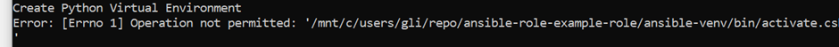
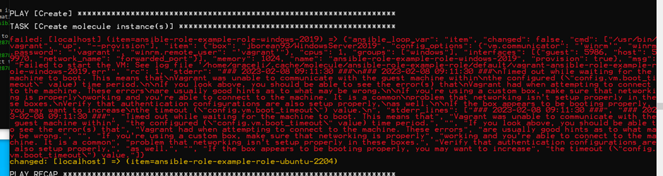
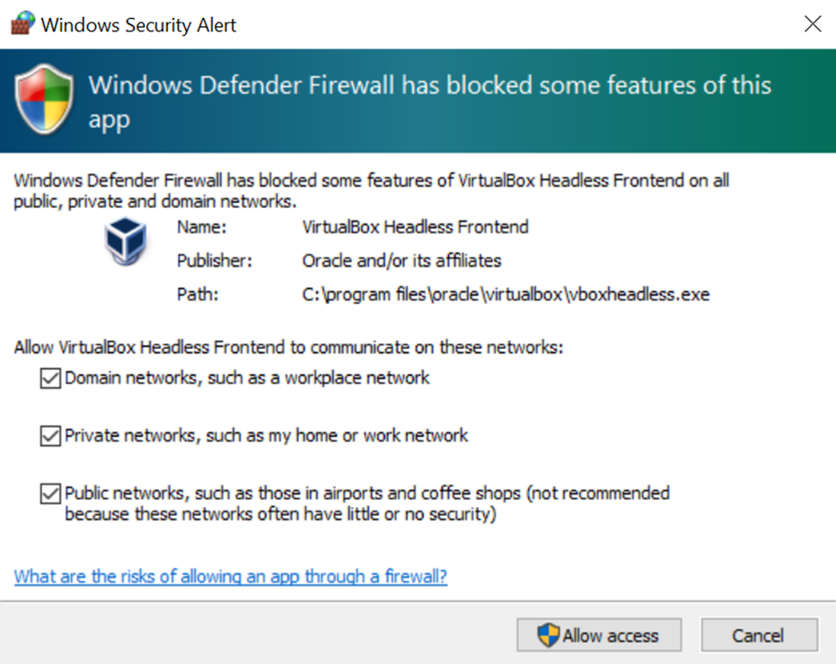
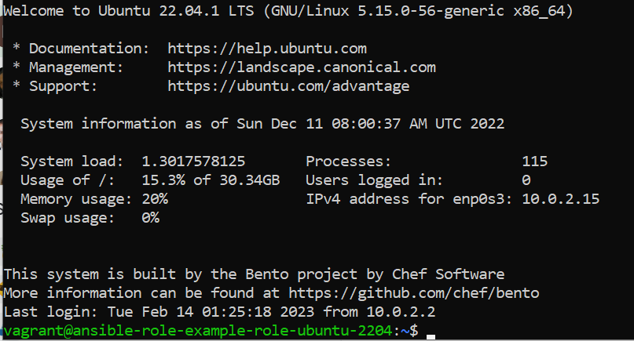

# Ansible Role Example Role
ansible-role-example-role

## About
This is an Ansible Example Role used for training and development

## Gotcha's (Sorry!!)
- M1 and M2 Mac Architectures are NOT supported at this stage
- Hyper-V is not supported at this stage
- Your Vagrant version on Windows and in WSL *MUST* be the same 
- Installing WSL could give error: `Catastrophic failure`
``` 
PS C:\Windows\system32> wsl --install
Installing: Windows Subsystem for Linux
Catastrophic failure
```
Restart laptop, run this installation command again, and make sure nothing is downloading in the background at the same time when running the command.


- WSL Ubuntu Install could give error: `An error occurred during installation. Distribution Name: 'Ubuntu' Error Code: 0x8000ffff`
```
PS C:\WINDOWS\system32> wsl --install -d ubuntu
Installing: Ubuntu
An error occurred during installation. Distribution Name: 'Ubuntu' Error Code: 0x8000ffff
```
Follow this link: https://askubuntu.com/questions/1434150/wsl-ubuntu-installation-fails-with-the-error-please-restart-wsl-with-the-follo and 
https://learn.microsoft.com/en-us/windows/wsl/install-manual#step-4---download-the-linux-kernel-update-package

Note : Run ``` wsl --install -d Ubuntu ``` in **non administrative** mode in powershell


```
PS C:\Users\User> wsl --shutdown
PS C:\Users\User> wsl --unregister Ubuntu
```
- If you have error when creating python virtual env: 
Close WSL and run `Restart-Service -Name "LxssManager"` as **Administrator in Powershell**, restart WSL and `./run.sh` again

- If you have error when bringing up VM: `vagrant was unable to communicate with the guest machine within the configured time period`

Set WSL Ubuntu Distro to version 1: run `wsl --set-version Ubuntu 1` in powershell, restart WSL and run `./run.sh` again

## Get Started! Dependencies (The Tools you will need)
:bulb: __IMPORTANT__ Install these Tools first, before we start actually using Molecule to develop our Ansible Roles

- Git - https://git-scm.com 
- VSCode - https://code.visualstudio.com
- Vagrant - https://www.vagrantup.com
- Virtualbox - https://www.virtualbox.org
- Python and Pip - https://www.python.org
- Windows Subsystem for Linux WSL (Windows Operating System), install as **Administrator in Powershell** - https://learn.microsoft.com/en-us/windows/wsl/install 
- WSL Ubuntu Distro, install as **Non-Administrator in Powershell** `wsl --install -d Ubuntu`
- Set WSL Ubuntu Distro to version 1 `wsl --set-version Ubuntu 1`
- SSHPass - https://www.cyberciti.biz/faq/how-to-install-sshpass-on-macos-os-x/

## Supported OSs for this Ansible Role
The Role supports the following Operating Systems and versions
See: `molecule/default/molecule.yml`

| Name | Docker | Virtualbox | Hyper-V | Host Arch | Host OS
|------|--------|------------|---------|-----------|---------|
| Windows 2016 | ✘ | ✓ | ✘ | amd64 | Windows, Mac, Linux |
| Windows 2019 | ✘ | ✓ | ✘ | amd64 | Windows, Mac, Linux |
| Redhat 7.9 | ✘ | ✓ | ✘ | amd64 | Windows, Mac, Linux |
| Redhat 8.3 | ✘ | ✓ | ✘ | amd64 | Windows, Mac, Linux |
| Centos 7.7 | ✘ | ✓ | ✘ | amd64 | Windows, Mac, Linux |
| Centos 8.3 | ✘ | ✓ | ✘ | amd64 | Windows, Mac, Linux |
| Ubuntu 18.04 | ✘ | ✓ | ✘ | amd64 | Windows, Mac, Linux |
| Ubuntu 20.04 | ✘ | ✓ | ✘ | amd64 | Windows, Mac, Linux |
| Ubuntu 22.04 | ✘ | ✓ | ✘ | amd64 | Windows, Mac, Linux |
| Debian 9 | ✘ | ✘ | ✘ | amd64 | Windows, Mac, Linux |
| Debian 10 | ✘ | ✘ | ✘ | amd64 | Windows, Mac, Linux |

## Instructions 
Here is how you can get up and running quickly, this section is devided into `Windows using Windows Subsystem for Linux WSL` and `Mac OSX` (Sorry Intel Mac's only at this stage) and Linux

### Windows (Ubuntu with WSL) and Linux (Ubuntu recommended)
Install all the Tools you need in the [__Get Started Section__](#get-started-dependencies-the-tools-you-will-need) 

Install Python

```
sudo apt update && sudo apt-get install -y python3 python3-pip python3-dev python3-virtualenv python3-venv
sudo update-alternatives --install /usr/bin/python python /usr/bin/python3 1 --force
sudo update-alternatives --install /usr/bin/pip pip /usr/bin/pip3 1 --force
```
Install SSHPass program

```
sudo apt-get install -y sshpass
```

Install Hashicorp Package Sources

```
wget -O- https://apt.releases.hashicorp.com/gpg | gpg --dearmor | sudo tee /usr/share/keyrings/hashicorp-archive-keyring.gpg 

echo "deb [signed-by=/usr/share/keyrings/hashicorp-archive-keyring.gpg] https://apt.releases.hashicorp.com $(lsb_release -cs) main" | sudo tee /etc/apt/sources.list.d/hashicorp.list

sudo apt update && sudo apt install vagrant

echo 1 > /proc/sys/fs/binfmt_misc/WSLInterop
```

Install Powershell in Ubuntu on WSL

```
sudo apt-get install -y wget apt-transport-https software-properties-common

wget -q "https://packages.microsoft.com/config/ubuntu/$(lsb_release -rs)/packages-microsoft-prod.deb"

sudo dpkg -i packages-microsoft-prod.deb

sudo apt-get update

sudo apt-get install -y powershell
```

Now let's run Molecule by going into the source directory where you cloned this repo, usually in Ubuntu on WSL somewhere under `/mnt/c/....`

and do

`./run.sh`


Allow all 3 types of network when set up Firewall for VirtualBox


### Mac 
Install all the Tools you need in the [__Get Started Section__](#get-started-dependencies-the-tools-you-will-need) 

Install SSHPass

```
brew tap esolitos/ipa
brew install esolitos/ipa/sshpass
brew install sshpass
```

Now let's run Molecule by going into the source directory where you cloned this repo

and do

`./run.sh`

After Molecule bringing up the Ubuntu VM in VirtualBox, to test connection to vagrant in VM, open a new WSL Ubuntu window, and run `ssh vagrant@127.0.0.1 -p 3225` or `ssh vagrant@localhost -p 3225`. Login with password: `vagrant`. 

Succesful ouput should be as below:



## Ansible Molecule on Windows using Windows Subsystem for Linux (Ubuntu) WSL, Vagrant and Virtualbox


## Ansible Molecule on Mac Intel, Vagrant and Virtualbox


## Links
- https://developer.hashicorp.com/vagrant/docs/other/wsl#path-modifications
- https://stackoverflow.com/questions/45375933/vagrant-wsl-cant-access-virtualbox
- https://learn.microsoft.com/en-us/windows/wsl/install
- https://molecule.readthedocs.io/en/latest/getting-started.html
- https://www.ansible.com/hubfs//AnsibleFest%20ATL%20Slide%20Decks/Practical%20Ansible%20Testing%20with%20Molecule.pdf
- https://www.jeffgeerling.com/blog/2018/testing-your-ansible-roles-molecule
- https://app.vagrantup.com/jborean93
- https://github.com/jborean93/packer-windoze

## Common Errors 

```
fatal: [ansible-role-example-role-ubuntu-2204]: FAILED! => {"msg": "to use the 'ssh' connection type with passwords or pkcs11_provider, you must install the sshpass program"}
```
Did you install the SSHPass application? See [__Get Started Section__](#get-started-dependencies-the-tools-you-will-need) 
